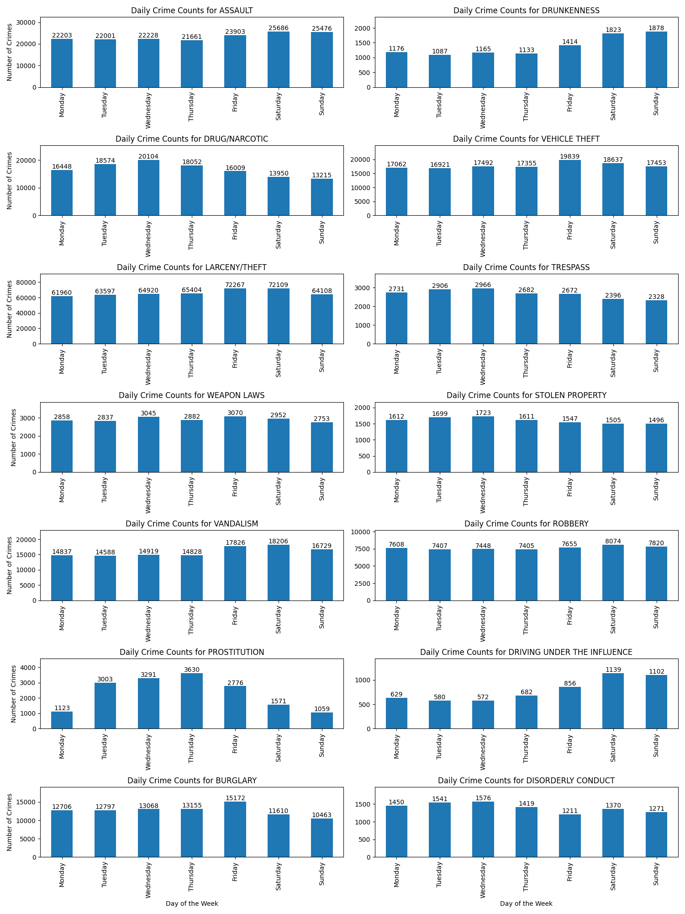

    

        <h2>Column 1</h2>
        
This is the content for column 1.

    

    

        <h2>Column 2</h2>
        
This is the content for column 2.

        <iframe src="{{ site.baseurl }}/assets/bokeh_plot.html" width="600" height="400"></iframe>
    

    

        <h2>Column 3</h2>
        
This is the content for column 3.

        
    

